# 46. As a MyPPR User, I want to be able to understand each MyPPR form field's purpose so that I can provide the most accurate information possible.

1. Staff
- My Profile: This basic employee profile is designed for this website only. No personal information will be shared outside of the department.
- Edit Account: Edit Name, Suffix, Nickname, User Address, and Secondary Email.
- Change Password: Change your password at anytime. It is recommended you change your password every three months!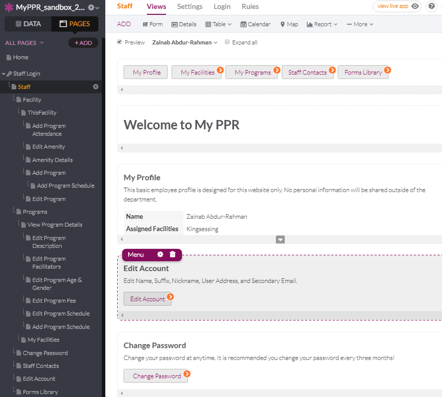

2. Facility
- My Facilities: Follow is a list of facilities you are associated with. View a facility's details to add or edit programs, amenities, or attendance.
  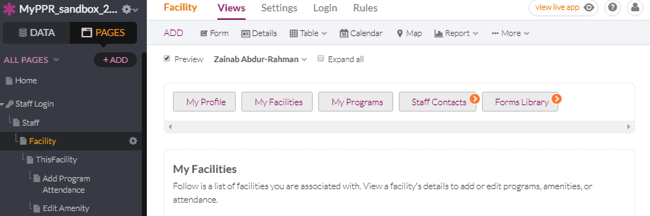

3. Add Program/Program Submission
- Facility: Choose your facility. 
- ActivityType: Select the activity type. Choose the closest type if yours is not available (Email additions to andyviren@phila.gov).
- ProgramName: Write a descriptive name for your program.
- FacilitatorType: Choose 1-3 of the facilitator types for your program.
- Program Description: Provide a description of your program. You may use rich text formatting to style your content.
- Targeted Age Groups: Which age groups is your program designed to engage?
- Age Start: How young do people have to be to join this program? If no starting age, Choose "1".
- Age Limit: What is the oldest age allowed for people in this program? If no limit, Choose "99".
- Fee: Please provide the fee and how often you require payment.
- Fee: What is the fee amount in dollars for this program? (If no fee, enter 0.00 and select Total/Season for Fee Frequency.)
- Fee frequency: How often is the fee applied?
- Amenities: Which of your facilities amenities will be used by this program? 
- RegistrationStatus: What is the current status of your program?
- RegistrationStartDate: When do you start registering participants? Enter today's date if you have already started.
- Publish to the website?: Submit program to be reviewed to publish online. Users will be able to search and express interest in this program.

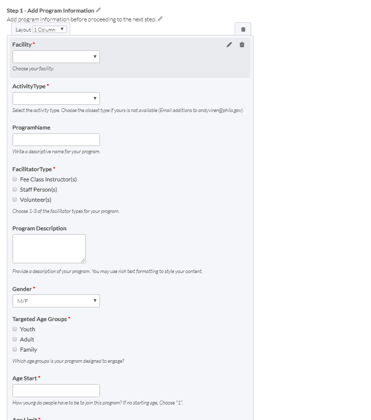
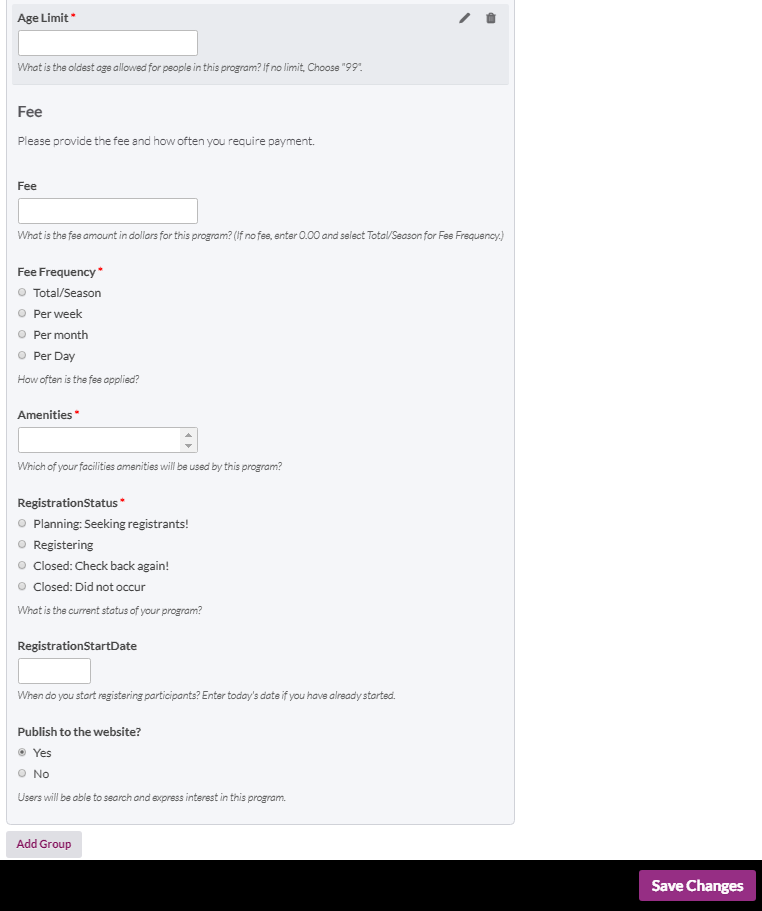

4. Edit Amenity:
- FacilityAmenityPhoto: Upload an image of your amenity.

- AmenityType: Choose one of the options for the type of amenity. (If you can't find a type that resembles your amenity, choose the best option.)

- AmenityName: Select a name for your amenity. 

- AmenityUse: What is this amenity typically used for?

- AmenityDescription: Please include a detailed description of your amenity. Include descriptions such as equipment or features  if available.

- Dimensions: Enter the dimensions of this amenity.

- MaxCapacity: What is the max number of people that can use this amenity.

  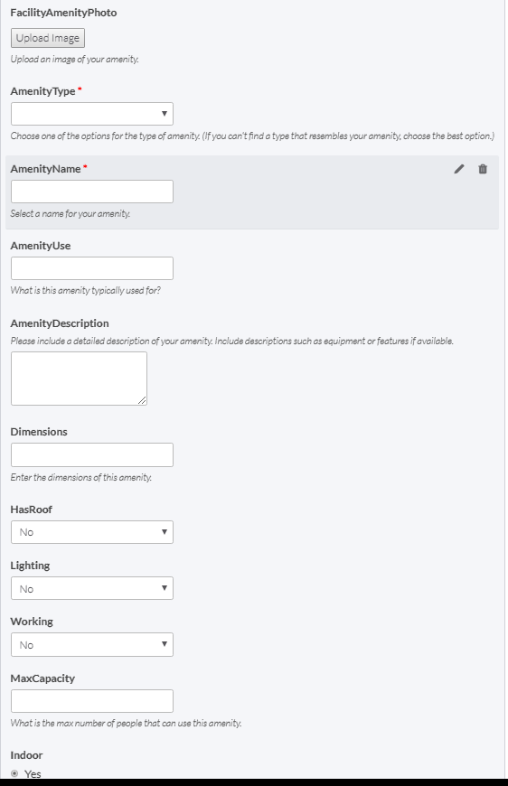

5. Add Prorgram Attendance: Add program attendance for your ACTIVE programs only. If a program is inactive, you may change it on the edit program screen. If Unique Individual Count is zero, no attendance is required to be entered.

- ​ Program: Choose from the selected facility's list of ACTIVE programs.
- Attendance Week: Please select the Monday of the week for which you are submmiting attendance.
- Registered Individuals Count: How many people were registered for this program for this week?
- Unique Individual Count: How many unique individuals showed up this week? (This should not be larger than the number registered.)
- Spectator Count: How many spectators attended this week? This should not include staff or volunteers.

   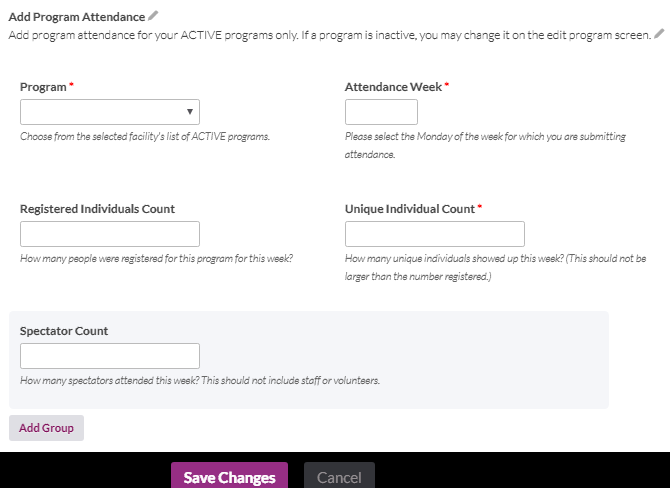

6. Edit Program
- Facility: Choose your facility.

- ActivityType: Select the activity type. Choose the closest type if yours is not available (Email additions to andyviren@phila.gov).

- ProgramName: Write a descriptive name for your program.

- FacilitatorType: Choose 1-3 of the facilitator types for your program.

- Program Description: Provide a description of your program. You may use rich text formatting to style your content.

- Targeted Age Groups: Which age groups is your program designed to engage?

- Age Start: How young do people have to be to join this program? If no starting age, Choose "1".

- Age Limit: What is the oldest age allowed for people in this program? If no limit, Choose "99".

- Fee: Please provide the fee and how often you require payment.

- Fee: What is the fee amount in dollars for this program? (If no fee, enter 0.00 and select Total/Season for Fee Frequency.)

- Fee frequency: How often is the fee applied?

- Amenities: Which of your facilities amenities will be used by this program? 

- RegistrationStatus: What is the current status of your program?

- RegistrationStartDate: Change the start date for registration for your program.

- IsActive: Is this program currently active? If you select no, it will not appear on the public website or in the Add Program Attendance form. 

- Publish to the website?: Submit program to be reviewed to publish online. Users will be able to search and express interest in this program.
  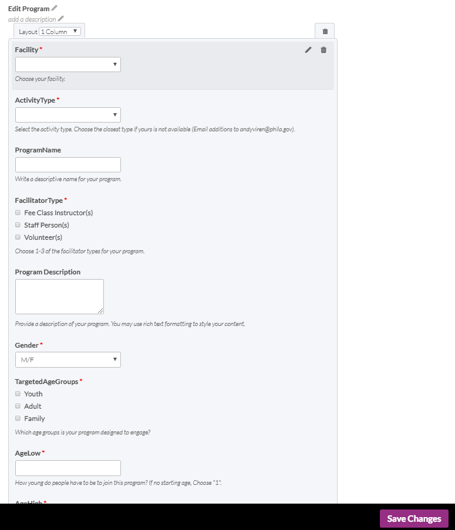
  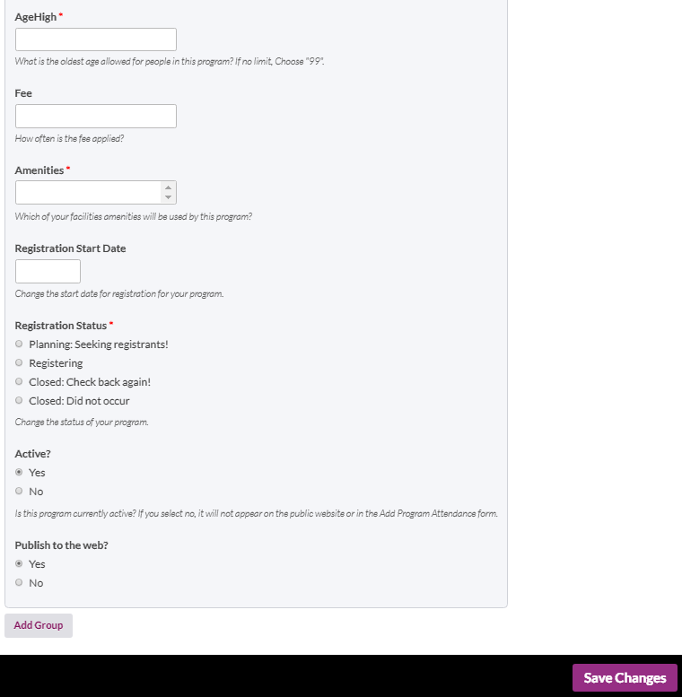

7. Programs View
- Edit Program Description: Provide a description of your program. You may use rich text formatting to style your content.

  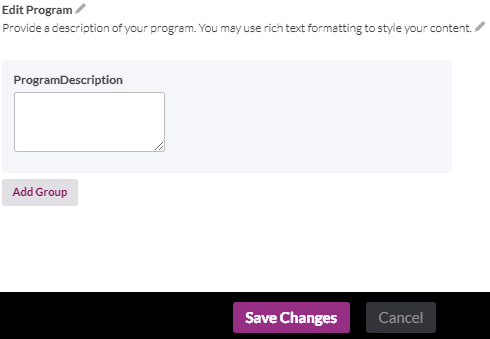

- Edit Program Faciliatators: Program facilitators are the individuals in the room, on the court, or on the sidelines leading instruction or game play. 

  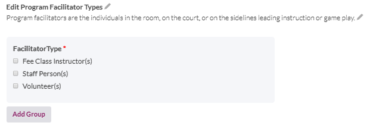

- Edit Program Age & Gender: Edit the targeted age and gender for this program. 

  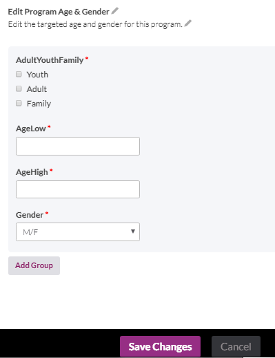

- Edit Program Fee: Edit the amount that is being charged to each.

  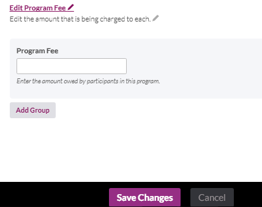

- Edit Program Schedule: Edit the schedule for this program.

  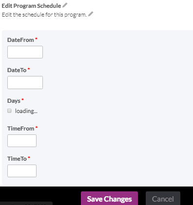

- Add Program Schedule: Add a program schedule. Older schedules are saved, this form just adds another one. 

  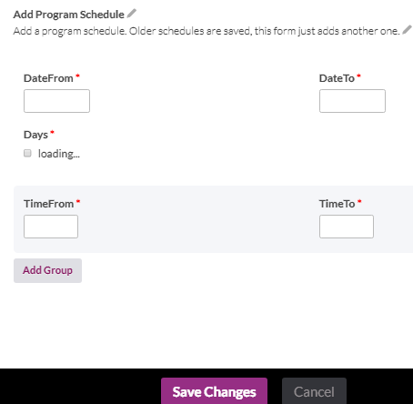