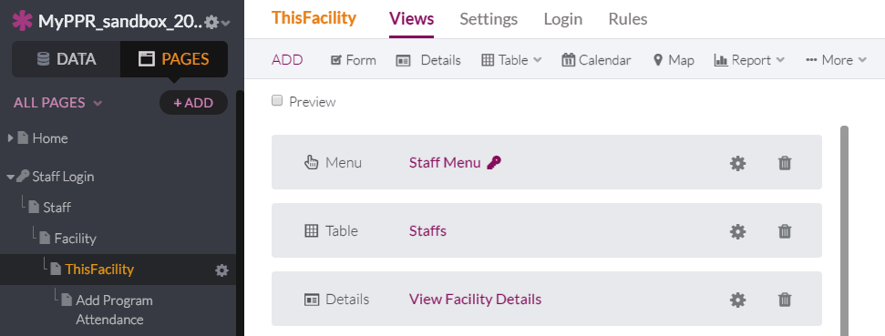

# 10 As a supervisor, I want to be able to know who is assigned to my facility so that I can know who has access to edit my programs

1. Edit This Facility View by adding Table (not list).
   

2. Choose Staffs
   

3. Click Add view
   

4. Keep Staffs table at the bottom and edit Staffs table.
   

5. Edit Table so that includes the following in order: Name, Email, Staff Title, Phone Number, Secondary Email. 
   

6. Edit Title and description as seen below. (Users with access to this facility on MyPPR) (This is a list of facility staff, managers, and support staff who have access to make changes to this facility.) Save Changes.

   

7. Add filter for Governance staff

   
