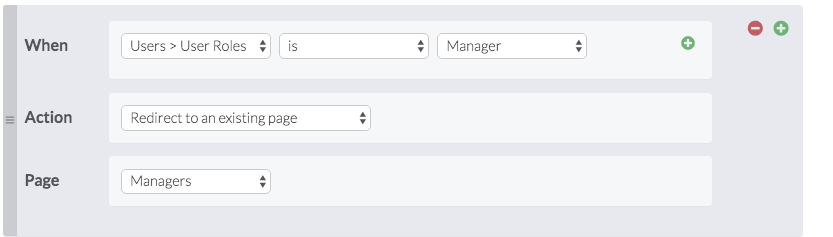

# Create New Login Page
## Created a new login page that redirects depending on what type of user you are
   
1. Go to Pages, choose "Add Page", and  create a blank page and title it "New Login"

2. Go to the Login tab in the New Login menu and select "Add Login." Make sure to allow access to all users

3. Go to the New Login View and add rules to the page: 
   
    * Create a rule such that when a User's role is Manager it redirects them to their respective landing page
  
    

    * Create three more rules that redirect each type of user: Staff, Admin, or Permit Request Applicant (not sure if supported yet)
  
    * when all four rules are added test with different user types to make sure it is redirecting as predicted

