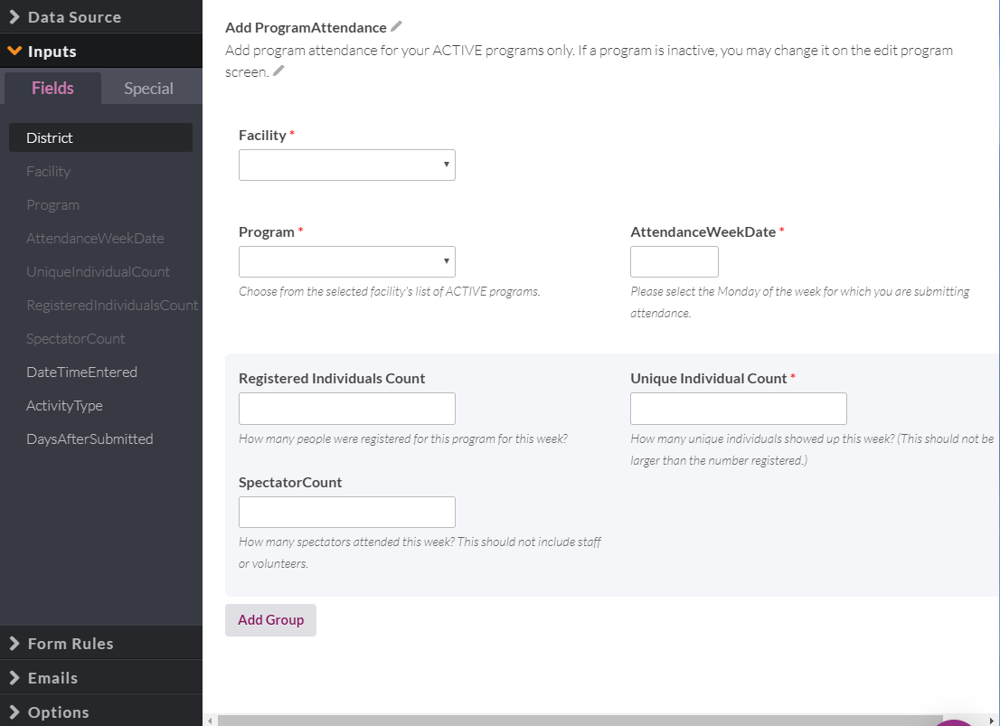

# 114- As a MyPPR supervisor, I want to be able to input attendance more quickly and easily.

## Knack: Create New Attendance Form

1. Go to Pages then Navigate to Staff, and  click add [Form] with the following options:
    * Records in your Database: Insert a new ***ProgramAttendance***
    * Check "Link to this form from a menu"
    * Select "Add the link to the existing Staff Menu menu"

2. Go to the new Add Program Attendance page and copy over the instructions and descriptions  and fields related to the current attendance form. Make sure the facility field is now added

    * 

3. Restrict Facilities to the logged in User's assigned facilities, and restrict programs to those that are assigned to the form's facility

3. Create a rule such that when the form is submitted, the page is reloaded. This involves redirecting the page to the following URL "javascript:location.reload(true)" NOT using the native Knack redirect.

## Update Javascript 

1. For the attendance page, find out the scene number, view number, and field numbers for the following fields: Attendance Week and Facility.

2. Input these numbers into the appropriate variables at the top of the ppr.js file. 

3. add link to ppr.js in index.html