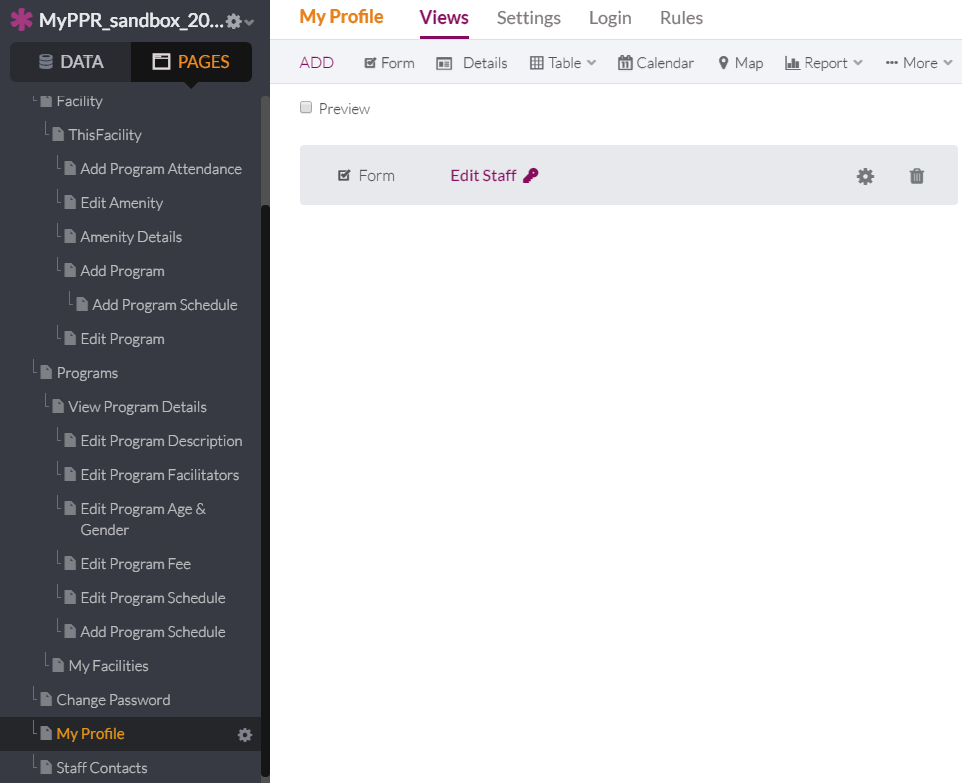
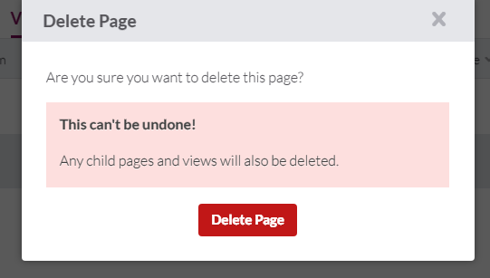
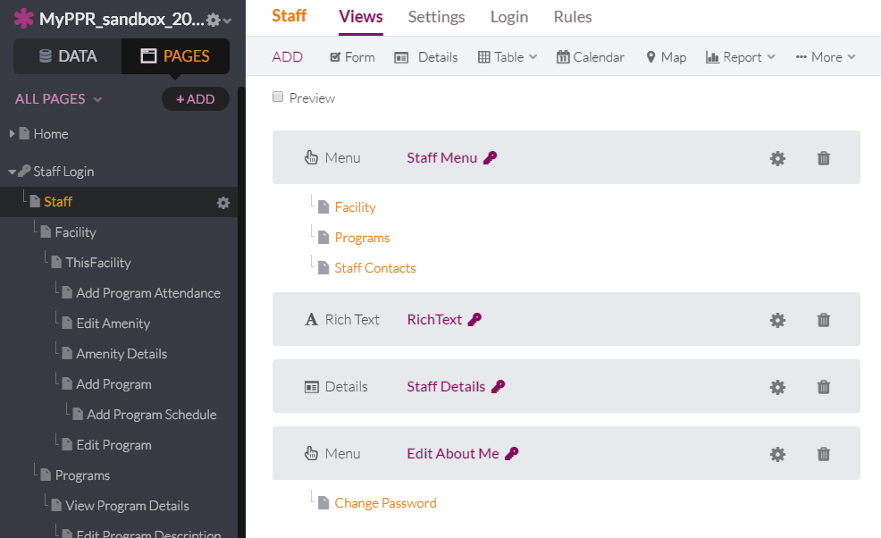
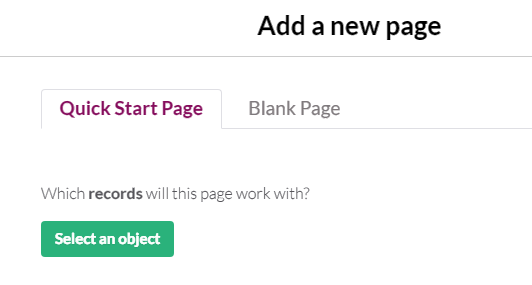
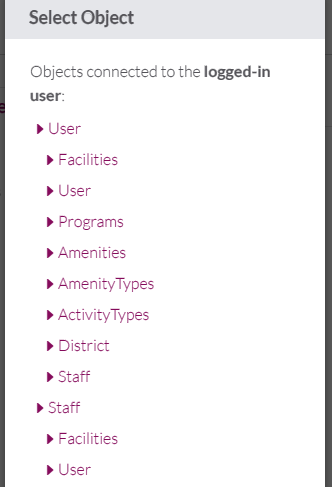
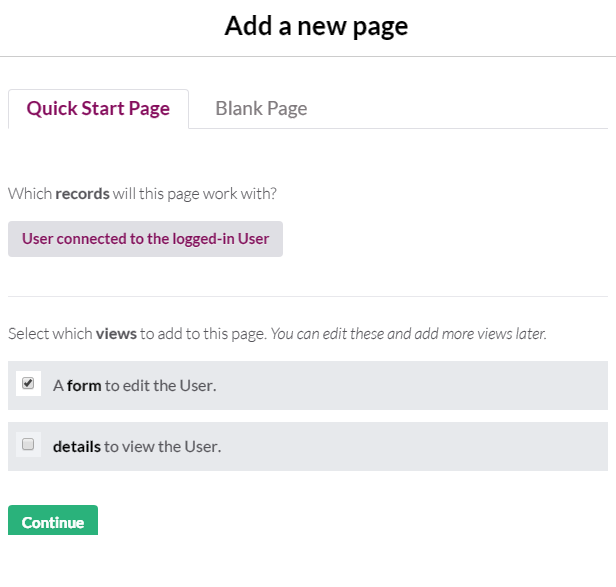
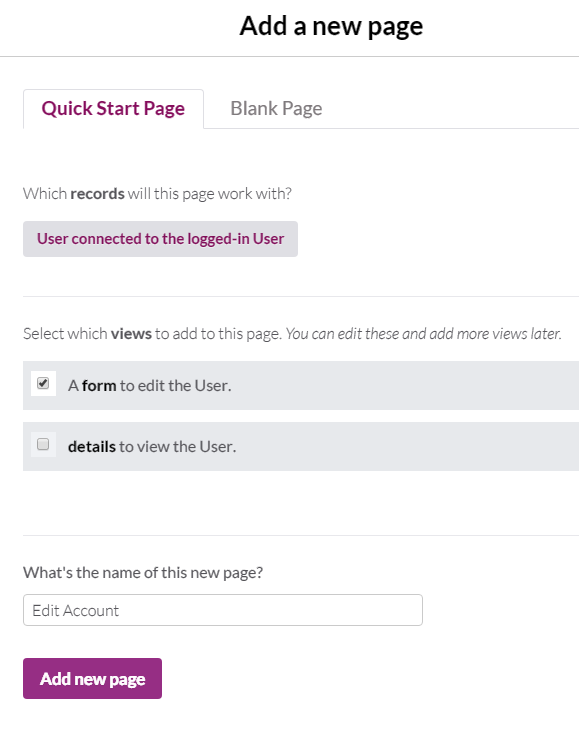
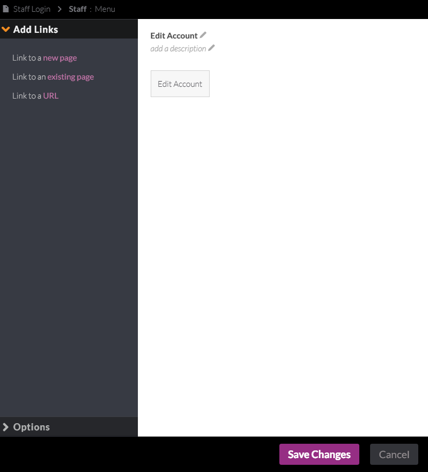
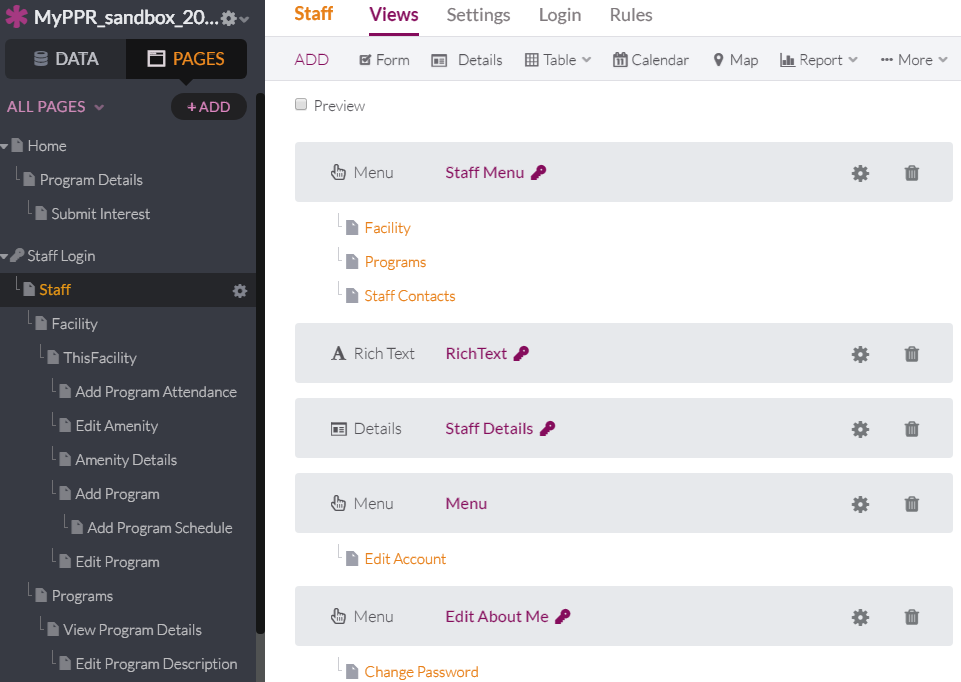

# 23. As a MyPPR user, I want to be able to update my profile information from any screen using the Knack defaults

1. Delete old My Profile page view.
   

2. Delete page.
   

3. Add new page.
   

4. Select an object.
   

5. Select User.
   

6. Check "A form to edit the User"
   

7. Name it Edit Account, then Add new page.
   

8. Edit and Save changes.
   

9. Make sure it is under Staff Details.
   

