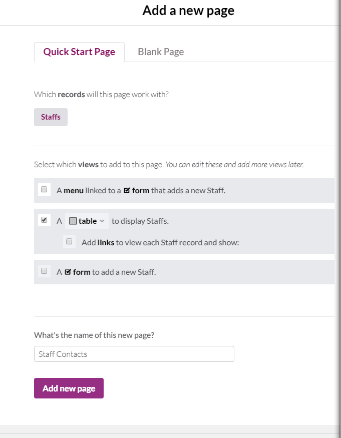
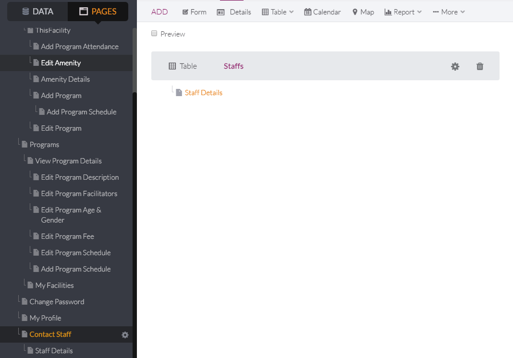

# 27 As a PPR staff person, I want to be able to view where one of my colleagues is assigned and their (facility) contact information, so that I can contact them.

1. Create new page using the "Link to a new page" Start by editing the "Staff Menu" in Staff.
   

2. Click on "Link to a new page"
   

3. Click "Select an Object" under the Quick Start Page tab.

   

4. Choose "Staff".

   

5. Check/un-check the boxes as seen below.

   

6. Name the page "Staff Contacts".

   

7. Save Changes.

   

8. Edit the View by clicking on the Staffs Table.

   

9. Edit the Table so it displays the following columns in the following order: Name, Assigned Facility, Email, Staff Title, Phone Number. (Note: change the column header for AssignedFacility so that it includes a space between the words.)  

10. Edit Staff Menus for Facility and Programs to include Staff Contacts, and create the Staff Menu in Staff Contacts. Start by clicking on the Staff Menu for the page for Facility.

11. Add link to an existing page.

12. Name it "Staff Contacts".

13. Save Changes.

14. Edit the Staff Menu in the Programs page.

15.  Add link to an existing page

16.  Save Changes.

17. Add a Staff Menu to the Staff Contacts page.

18. Add a Menu, name it Staff Menu* and move it above the Staffs table.

19. Edit until it works like the other menus, seen below: My Profile, My Facilities, Programs, Staff Contacts

   
