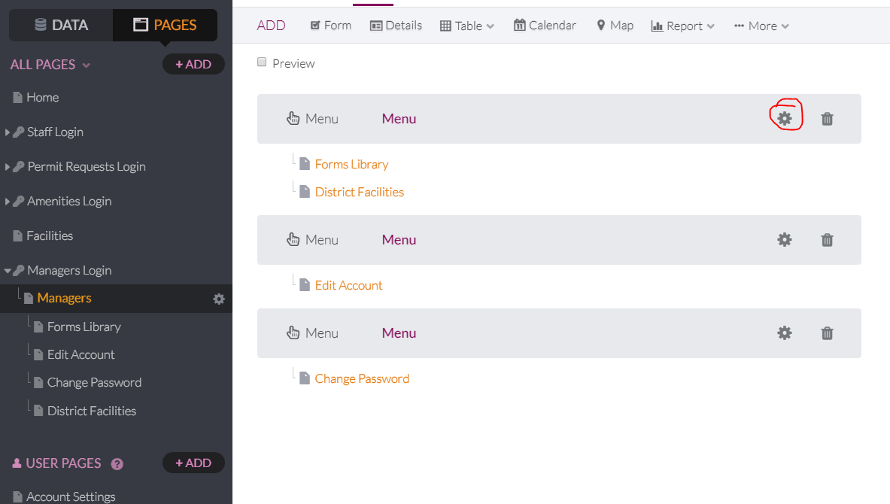
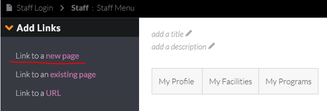
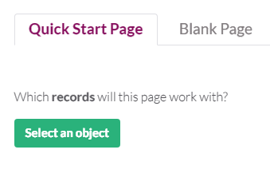
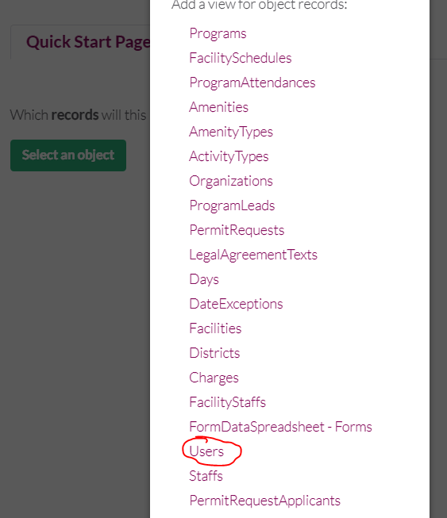
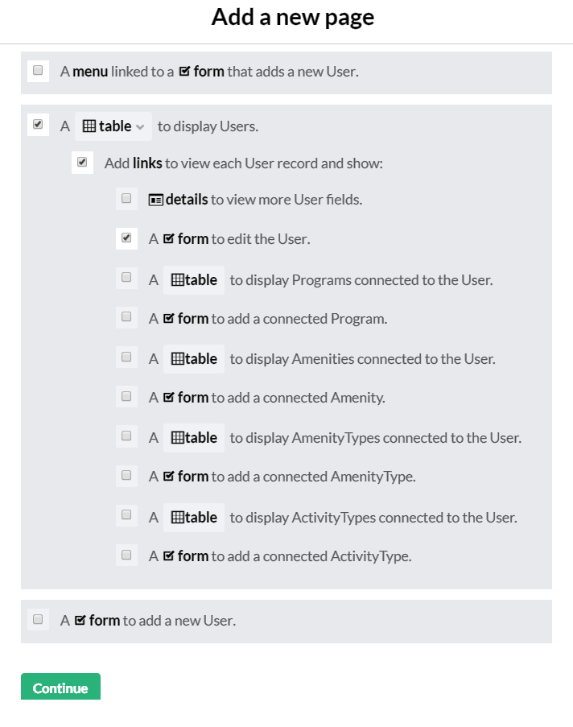
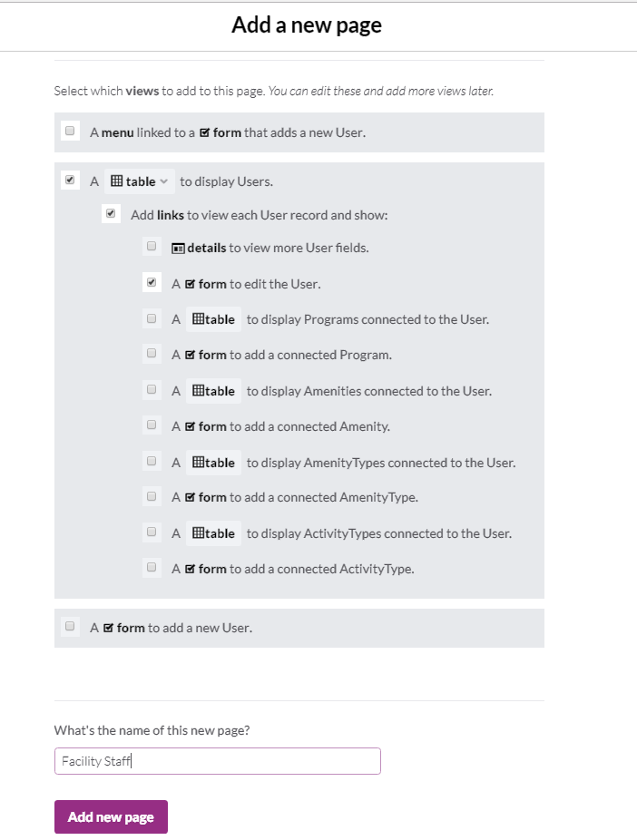
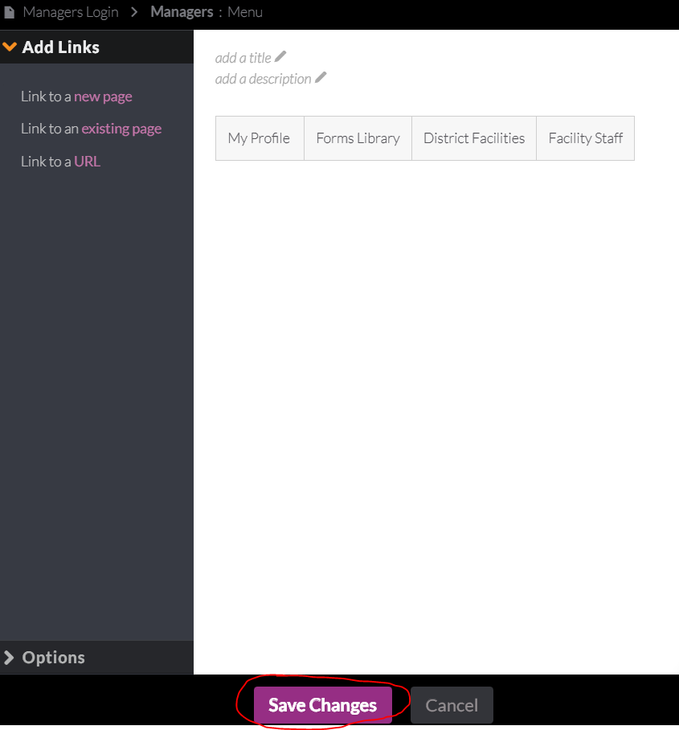
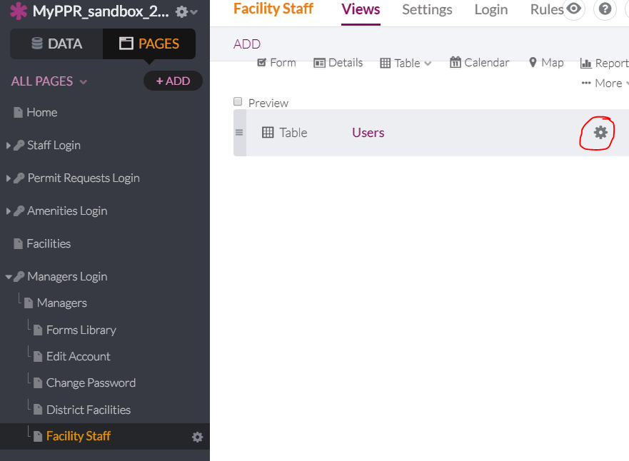
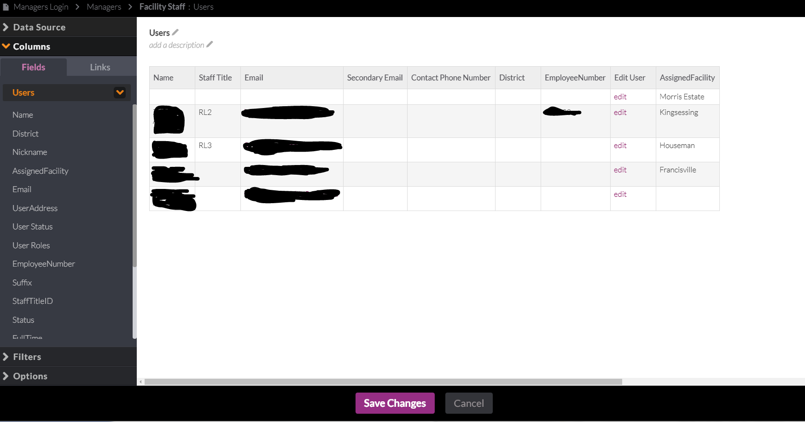
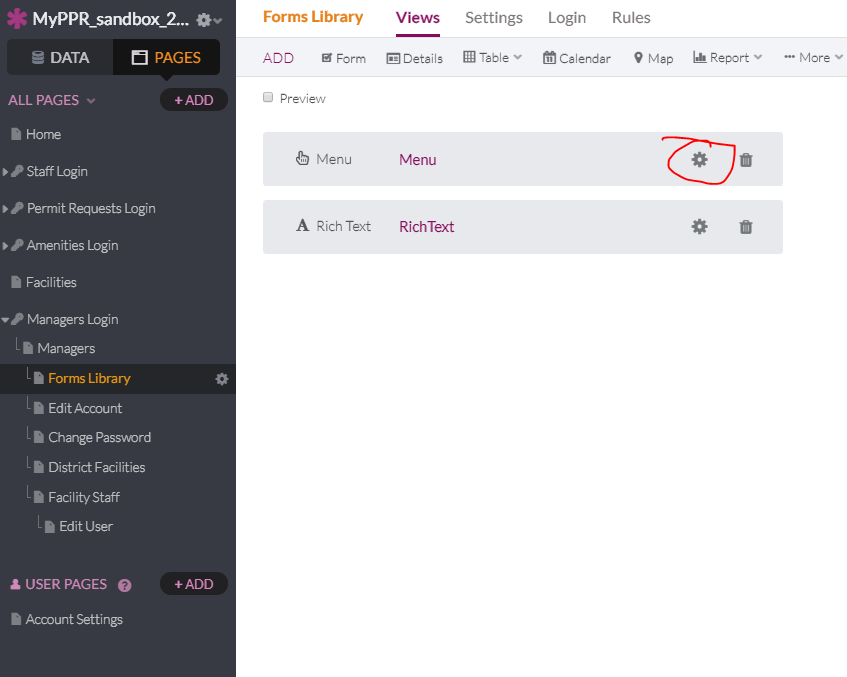

# 28. As a MyPPR Manager, I want to be able to manage where my staff are in a easy to use interface so that I can have an authoritative list of where staff are assigned.

1. Click Settings icon in Menu under the Manager's page.
   

2. Create Link to a new page.
   

3. Click "Select an Object" under the Quick Start Page tab.
   

4. Choose "Users".
   

5. Check/un-check the boxes as seen below.
   

6. Name the page "Facility Staff".
   

7. Save changes.
   

8. Edit the view by clicking the settings icon on the Facility Staff table.
   

9. Edit the table so it displayys the following columns in the following order with these titles: Name, Staff Title, Email, Secondary Email, Contact Phone Number, District, Employee Number, Edit User, Assigned Facility.
   

10. Add the Facility Staff to the other menus in the Mangers role. Click on the settings icon for the Menus each of the views for Manager. 
   

