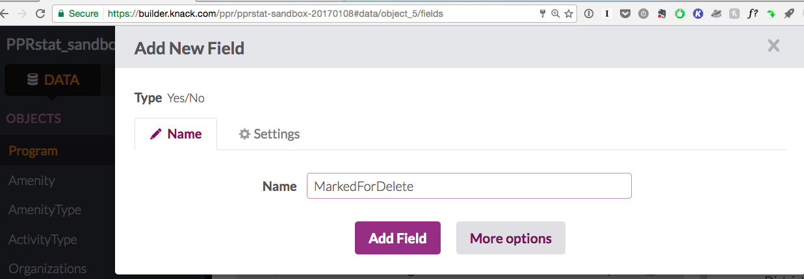

# #40 As a facility supervisor I want to be able to delete programs, attendance, and schedules

## Make changes to data model

#### Add "CountofAttendance" field type Count to Program table 

- [ ] 

#### Add  "CountOfSchedules" field type "Count" to Program table

- [ ] 

#### Delete PermitRequest field from FacilitySchedule table

This field is unnecessary and is a remnant of when Andy was trying to build a simultaneous permitting app.

- [ ] 

#### Add "delete record" link to [Add Attendance View Attendance Table](#pages/scene_233/views/view_428) 

- [ ] 

#### Add "delete record" link to [Program Details: Program Schedules](#pages/scene_244/views/view_456)

- [ ] 

#### Add "MarkForDelete" boolean type field to [Program table](#data/object_5/fields).

- [ ] 

## Make changes to Pages to [Program Details View](https://builder.knack.com/ppr/pprstat-sandbox-20170108#pages/scene_244)

- [ ] #### Add "Manage Attendance for Program" view with button text "Manage Attendance"
      - [ ] ##### ADD Program details view
            	Add Special: Title: "Add, edit or delete attendance for:"
            	Add Program Name. Remove Label. H1
      - [ ] ##### ADD Form
            	Add Date, Registered, Unique, Spectators fields
            	Add title: Add attendance
            	Add subtitle: Add new attendance for this program and hit "Submit"
      - [ ] ##### ADD Table: ProgramAttendance 

            	Title: Edit or delete current attendance
            	Subtitle: Edit current data by clicking on cell. 
            	Add week, registered, unique, spectators headings
            	Add delete column with trash icon
            	Options: Check "Inline Editing"

- [ ] #### ADD Menu Button with "Delete Program" text to the bottom of the page
- [ ] #### ADD linked page/scene "Program Details Before Delete" 
      - [ ] #####Add Program Details View
            	Add ProgramFullName field hide label, H1
      - [ ] ##### Add Program Details View
            - Subtitle: "Before deleting this program record, please ensure that there are no related attendance or schedule records."	
            - Edit Group: 2 columns	Special: Title: Number of Attendance Records	
            - Special: Link to another Page: Manage Attendance for Program		Special: Title: Number of Schedule Records

      CountofAttendance field and link to Manage Attendance for Program page 

      CountofSchedules field and link to Manage Schedules for Program page

- [ ] ##### Menu linked to new page with "DELETE" as text

      - [ ] ##### Confirm Delete Program 

            - [ ] Label: Are you sure you want to delete this program?
            - [ ] Instructions: You can not undo thisSettings Options: Display page in a modal popup            

### Filter other pages with Programs to remove MarkedForDelete=Yes programs

### Clean up Attendance Management Views

https://builder.knack.com/ppr/pprstat-sandbox-20170108#pages/scene_234/settings

change to "manage"

