# 42 As a MyPPR Staff, I want my programs to automatically be marked as inactive so that I can more easily manage my programs

### Make Programs Inactive
1. Go to Data and go to Tasks under FacilitySchedule.

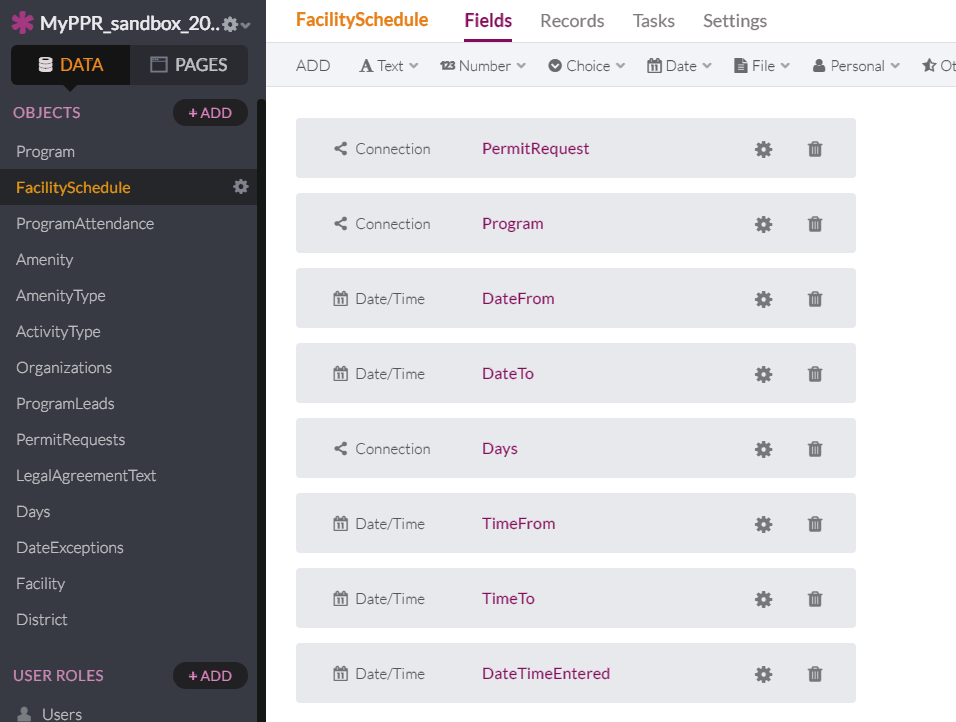

2. Click Add Task.

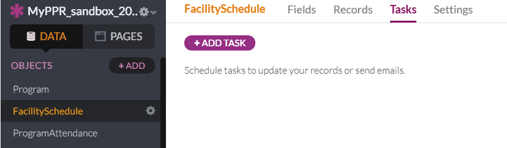

3. Fill out as shown below.

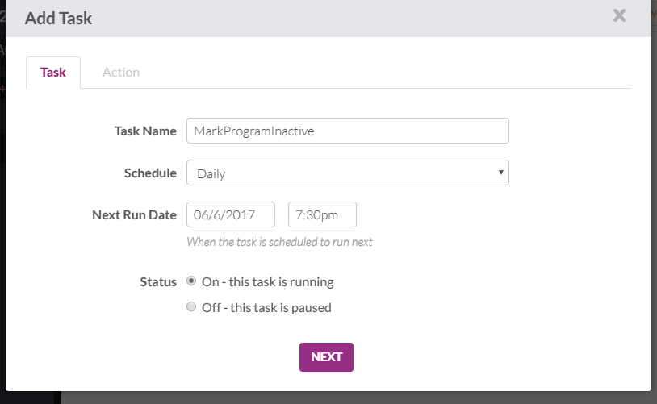

4. Fill out as shown below and Save Task.

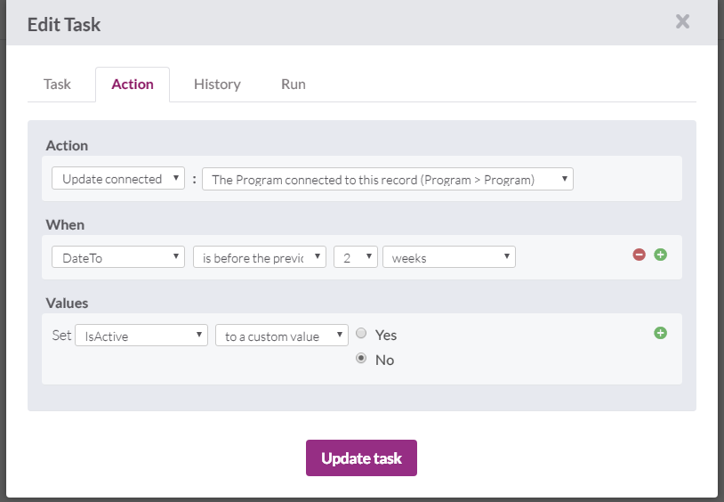

### Make Programs Active

5. Go to Data and go to Tasks Under Facility Schedule
   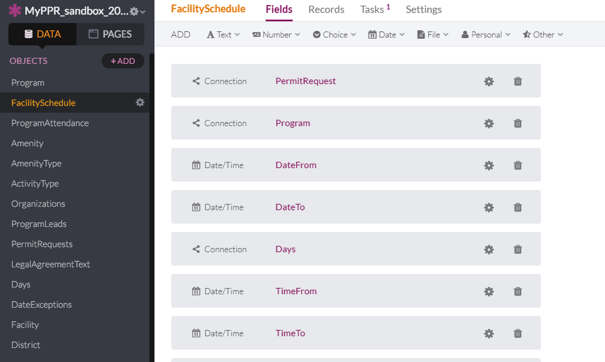

6. Click to Add Task
   

7. Fill out as shown below.
   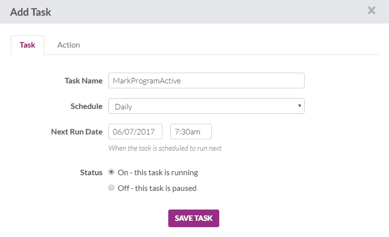

8. Fill out as shown below and Save Task.
   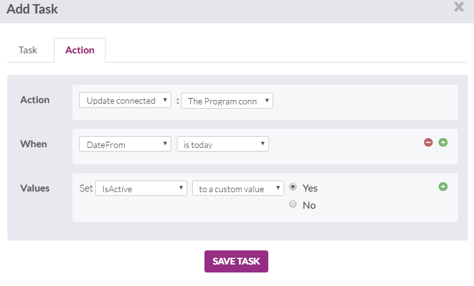

### Change view for

9. Edit the Programs table under ThisFacility.
   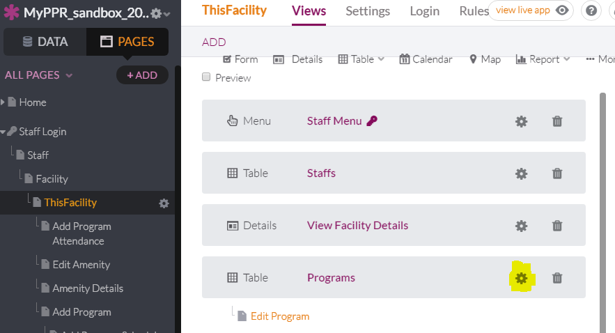

10. Add IsActive to the table
   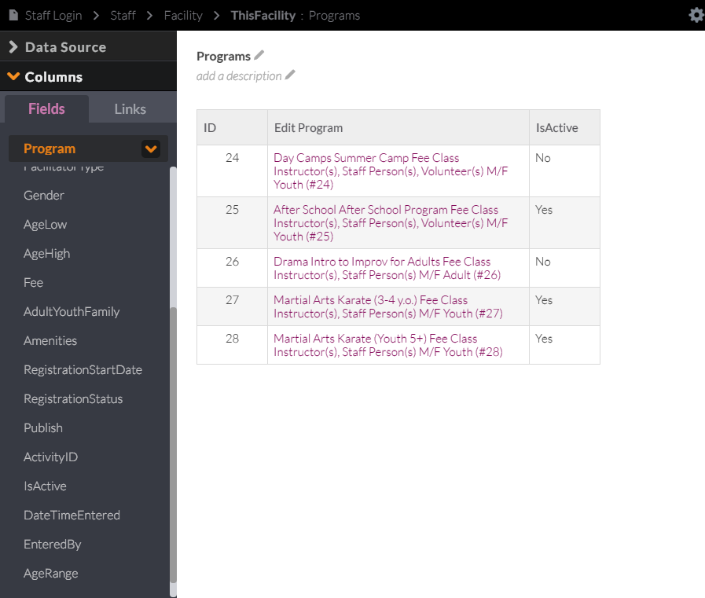

11. Edit the Column Header to "Is Program Active?"

   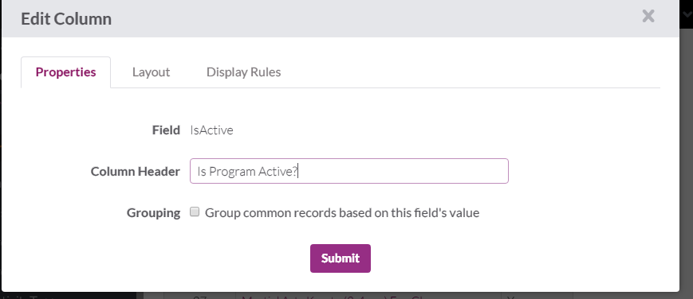

12.  Go to Options and check Inline Editing. Save Changes.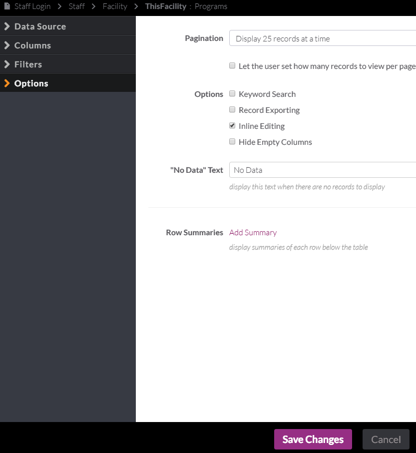
