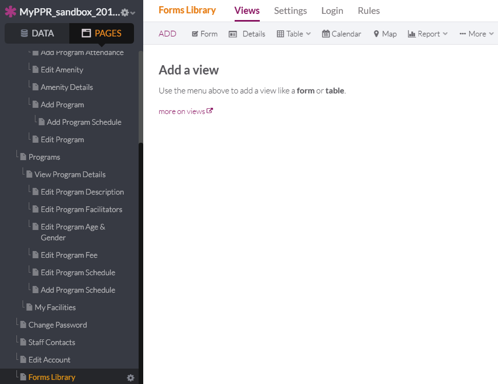
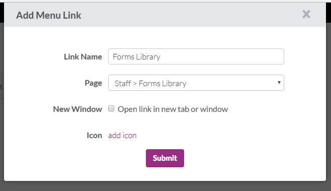
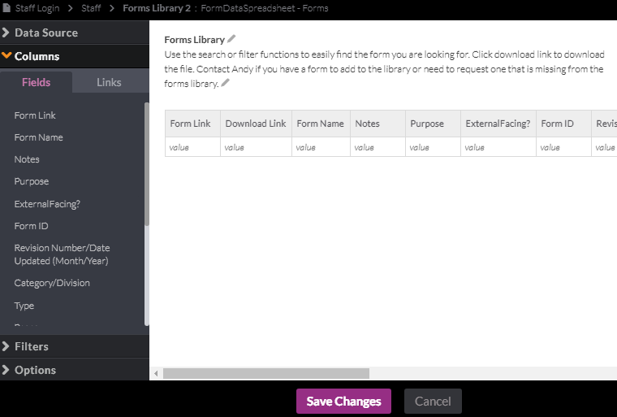

# 45. As PPR staff, I want to access a list of the forms that are associated with PPR so that I can complete and submit them.

### Create CSV
1. Create CSV file from the Forms library.
   

2. Add Data.
   

3. Upload CSV and click Next.
   

4. Set data as follows, add spaces where needed:
- Short Text: Form Link, Form Name, Form ID, Revision Number, Grouping, Relative Link
- Paragraph Text: Notes, Purpose, Status
- Boolean: ExternalFacing?, Online Submission?, Online Availability
- Multiple Choice: Source, Category/Division, Type, Scan/PDF, Job Association, ROT, Source
- Number: Pages
- Link-URL: Download Link

  

5. Add Link in Staff View.
   

6. Add Link to a new page.
   

7. Select an object.
   

8. Choose ""
   

9. Only check a table to display FormDataSpreadsheet - Form. Click Continue, then Name the file Forms Library.
   

10. Adjust links as seen below and click Save Changes.
   

11. Edit Staff Menu in Staff Contacts to add Forms Library link.
   

12. Add Link to URL to Forms Library.
   

13. Edit Link Name to "Forms Library" and Link URL to "#forms-library". Then click submit.
   

14. Add Staff Menu to the Forms Library by adding a menu. 
   

15. Edit the Menu using the settings icon.
   

16. Edit the Menu to include links to My Profile (#staff), My Facilities (#facility), My Programs (#programs), Staff Contacts (#staff-contacts), and Forms Library (#forms-library).
   

17. Edit the table by clicking the settings icon.
   

18. Add the Columns in the order: Form Name, Purpose, Download Link
   

19. Edit Header to "Forms Library" and caption to "Use the search or filter functions to easily find the form you are looking for.  Click download link to download the file.  Contact Andy if you have a form to add to the library or need to request one that is missing from the forms library." Click Save Changes.
   
