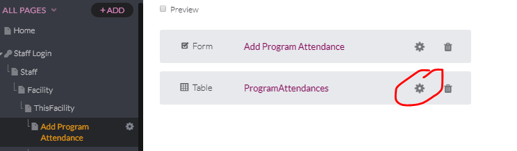
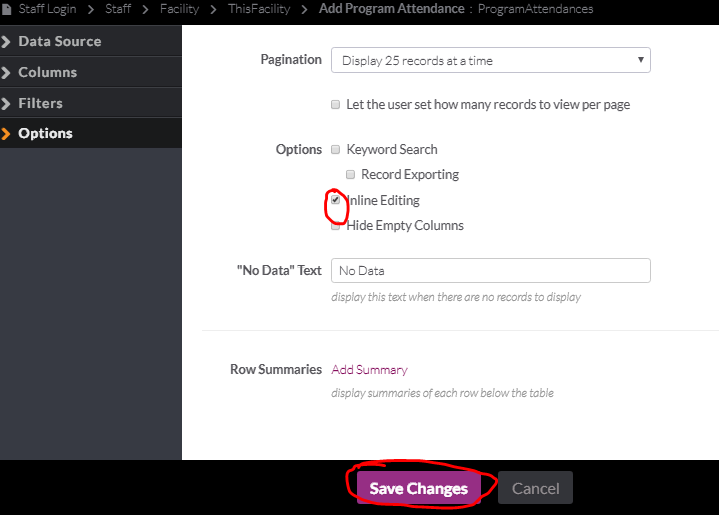
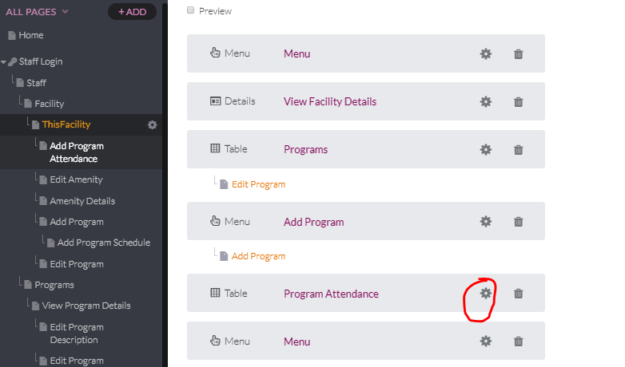
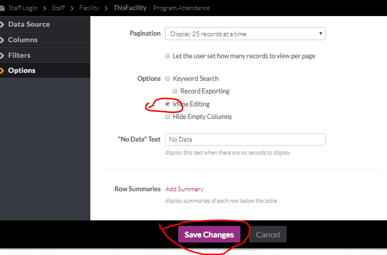

# [As MyPPR Staff, I want to edit or delete program attendance that has been inputted incorrectly.](https://github.com/andrewviren/MyPPR/issues/54)

1. Edit the ProgramAttendances table in the Add Program Attendance View.
   

2. Go to options and click Inline editing, then click save.

   

3. Edit the Program Attendance table in the ThisFacility View.

   

4. Go to options and click Inline editing, then click save.

   