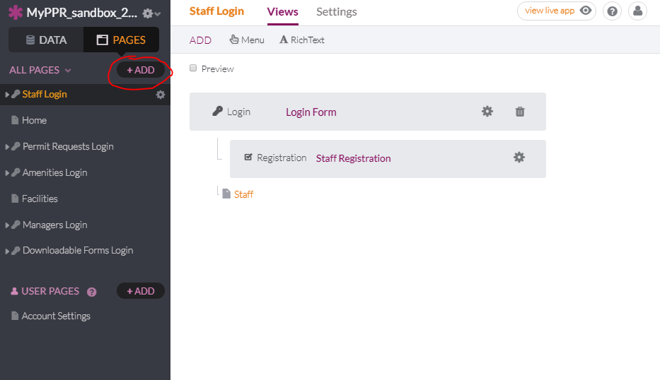
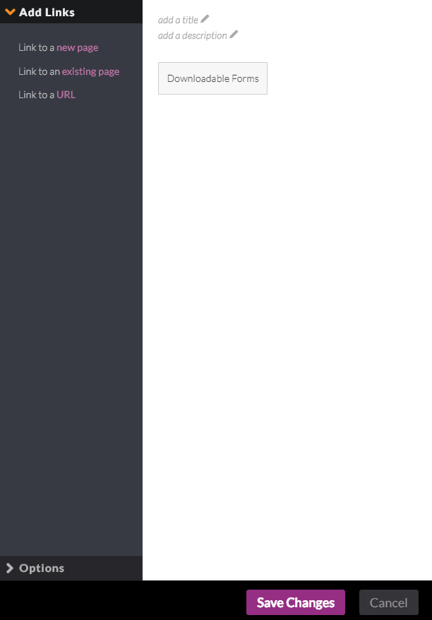

# #62 As a non-recreation leader PPR employee, I need a view that better suits my needs as a PPR employee.

1. Create new user role by clicking Add.
   
2. Name User Role "Personnel" and click on Add object.
   
3. Under Personnel click Add Connection.
   
4. Add a new Connection to An Existing Object by selecting "Users". and clicking next.
   
5. Select Each User connects with one personnel, then click Add Connection.
   
6. Click Add under Pages.
   
7. Click on "Yes, a user must login to access this page" as well as "Limit permissions to specific user roles" then  choose Personnel and click Continue.
   
8. Click Select an object and Choose User, then click Continue.
   
9. Name the page Personnel and click Add new page.
   
10. Click More under Personnel and create a new Menu.
   
11. Click the settings icon on the Menu you just created.
   
12. Create a Link to a new page.
   
13. Click on Select an object.
   
14. Make sure only the table to display Downloadable Forms is clicked, then click Continue.
   
15. Name the page "Downloadable Forms" then click Add New page
   
16. Click Save Changes
   
17. Click the settings icon under Downloadable Forms
   
18. Set the Columns in the following order: Form Name, Download Link, Purpose, Work Unit, Document Pages, Records Department Form ID, Records Department Revision Date. Then click Save Changes.
   