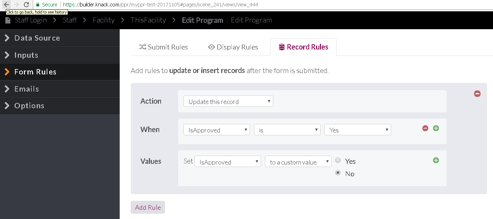

# Allow for new Programs to be published to Carto/Finder app #72

## Change table structure to allow for approved status  

1. Change "Publish" field to "IsPublic" field
2. Add Yes/No type field:
   * Name: "IsApproved"
   * Labels: "Yes/No"
   * Default: No
   * Require "yes": false
   * Input: Radio Buttons

## Add a trigger to each form that a program is changed to mark program as not approved.

### When submitting a new program

1. Default for IsActive = "no" so each new program should require approval after entry.

###  When editing a program

- [x] Add a record rule to the form at \#pages/scene_241/views/view_444
     

- [x] add record rule to the form \#pages/scene_245/views/view_449

     * Action: Update this record
     * When: "IsApproved" is "Yes"
     * Values: Set "IsApproved" to "No"

- [x] add record rule to the form at \#pages/scene_247/views/view_451

     - Action: Update this record
     - When: "IsApproved" is "Yes"
     - Values: Set "IsApproved" to "No"

- [x] add record rule to the form at \#pages/scene_248/views/view_452

     - Action: Update this record
     - When: "IsApproved" is "Yes"
     - Values: Set "IsApproved" to "No"

- [x] add record rule to the form at \#pages/scene_249/views/view_453

     - Action: Update this record
     - When: "IsApproved" is "Yes"
     - Values: Set "IsApproved" to "No"

- [x] add record rule to the edit program schedule form \#pages/scene_252/views/view_457

     - Action: Update this record
     - When: Every form submission
     - Values: Set "IsApproved" to "No"

- [x] add record rule to the ADD program schedule form \#pages/scene_254/views/view_461

     - Action: Update this record
     - When: Every form submission
     - Values: Set "IsApproved" to "No"

- [x] add record rule to the Edit Additional Program Content form \\#pages/scene_303/views/view_553

     - Action: Update this record
     - When: "IsApproved" is "Yes"
     - Values: Set "IsApproved" to "No"

     ​

